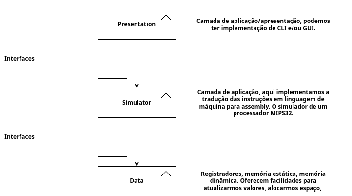
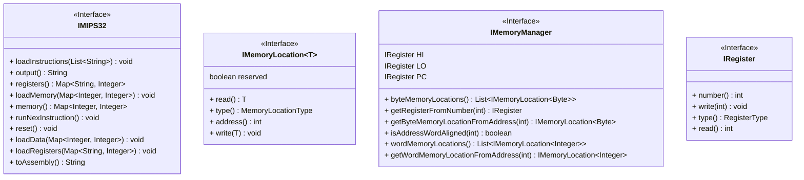

# Projeto: Simulador MIPS32

MIPS32 é um conjunto de instruções 32 bits. Esse projeto permite executar diferentes instruções dessa arquitetura através de uma simulação de um microprocessador MIPS.

## Arquitetura do Sistema

O Simulador é organizado em 3 camadas distintas:

- Camada de **Apresentação**, responsável pela exibição dos dados e comunicação com o usuário (leitura de entradas, produção de saídas, etc);
- Camada de **Simulação**, que implementa as funcionalidades de um processador MIPS32 (instruções, controle de memória, execução, etc);
- Camada de **Dados**, implementa as estruturas de memórias utilizadas pelo processador (registradores, memória principal);

A comunicação entre as camadas ocorre através de *interfaces* que definem quais funcionalidades são oferecidas por cada uma das camadas.

- A interface `IMemoryManager`, e as interfaces auxiliares `IRegister` e `IMemoryLocation`, define um controlador de memória. Esse controlador (classe) é responsável pelo controle dos diferentes registradores e espaços de memória existentes.
- A interface `IMIPS32` define todas as funcionalidades disponibilizadas por um processador MIPS de 32 bits.

# Equipe

- Lucas Henrique 
- Moésio Filho 
- Vitor Alencar 

---
*Os requisitos do projeto podem ser encontrados em [Projeto Simulador MIPS](https://view.genial.ly/62cf619eccc76b0014a9441f/interactive-content-aoc20212projeto-mips).*